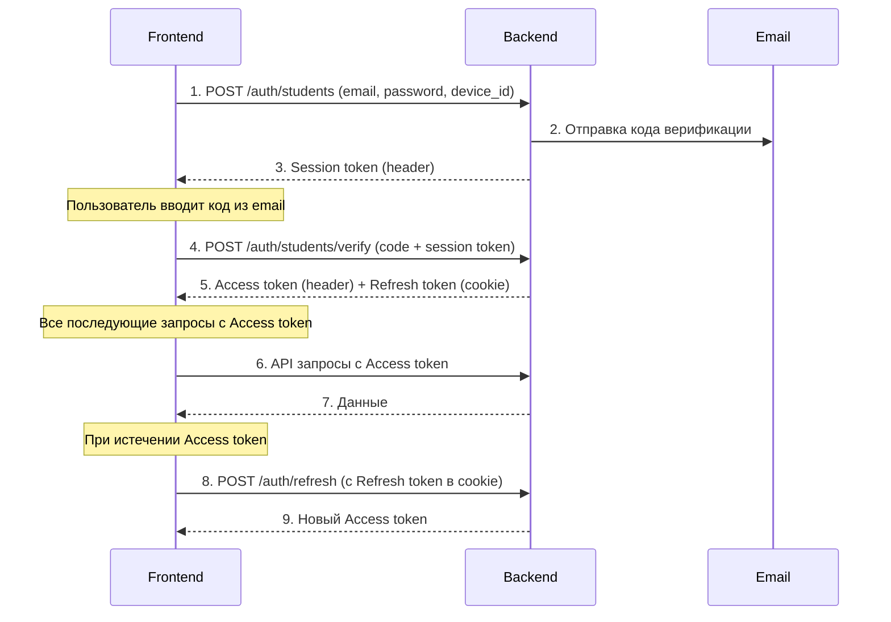

## Базовый URL
```
Development: http://localhost:8080

```

---

## 🔐 Аутентификация

### 1. Регистрация пользователя
**Отправка email и пароля, получение session token**

```
POST /auth/students
```

#### 📤 Запрос

**Headers:**
```http
Content-Type: application/json
```

**Body:**
```json
{
  "email": "user@example.com",
  "password": "Password123!",
  "device_id": "device_1234567890"
}
```

**Поля:**
| Поле | Тип | Обязательное | Описание |
|------|-----|--------------|----------|
| email | string | ✅ | Email пользователя |
| password | string | ✅ | Пароль (8-72 символа) |
| device_id | string | ✅ | Уникальный ID устройства |

**Требования к паролю:**
- Минимум 8 символов
- Максимум 72 символа
- Хотя бы 3 из 4 типов символов:
  - Заглавные буквы (A-Z)
  - Строчные буквы (a-z)
  - Цифры (0-9)
  - Специальные символы (!@#$%^&*)

#### 📥 Ответы

**✅ Успех (200 OK)**

**Headers:**
```
Token: eyJhbGciOiJIUzI1NiIsInR5cCI6IkpXVCJ9...
```

**❌ Ошибка валидации (400 Bad Request)**


**❌ Пользователь уже существует (409 Conflict)**


### 2. Верификация пользователя
**Подтверждение email кодом, получение токенов**

```
POST /auth/students/verify
```

#### 📤 Запрос

**Headers:**
```http
Content-Type: application/json
Token: eyJhbGciOiJIUzI1NiIsInR5cCI6IkpXVCJ9...
```

**Body:**
```json
{
  "code": "123456"
}
```

**Поля:**
| Поле | Тип | Обязательное | Описание |
|------|-----|--------------|----------|
| code | string | ✅ | 6-значный код из email |

#### 📥 Ответы

**✅ Успех (200 OK)**

**Headers:**
```
Token: eyJhbGciOiJIUzI1NiIsInR5cCI6IkpXVCJ9...  // Access Token
Set-Cookie: refresh_token=eyJhbGciOiJIUzI1NiIsInR5cCI6IkpXVCJ9...; Path=/; HttpOnly; SameSite=Lax
```

**Важно:** 
- **Access Token** передается в заголовке `Token`
- **Refresh Token** автоматически устанавливается в HttpOnly cookie (браузер сам его сохранит)

**❌ Неверный код (403 Forbidden)**

**❌ Просроченный session token (401 Unauthorized)**

## 🔄 Работа с токенами

### Типы токенов

| Токен | Где хранится | Время жизни | Использование |
|-------|--------------|-------------|---------------|
| **Session Token** | memory / state | 3 минуты | Для верификации email |
| **Access Token** | memory | 15 минут | Для авторизации API запросов |
| **Refresh Token** | HttpOnly cookie | 7 дней | Для обновления access token |

### Использование Access Token

После успешной верификации, все последующие запросы к API ребующие авторизации должны содержать access token в header с заголовком 

## 📊 Полный сценарий работы

### Схема аутентификации



